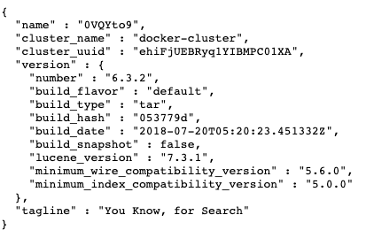
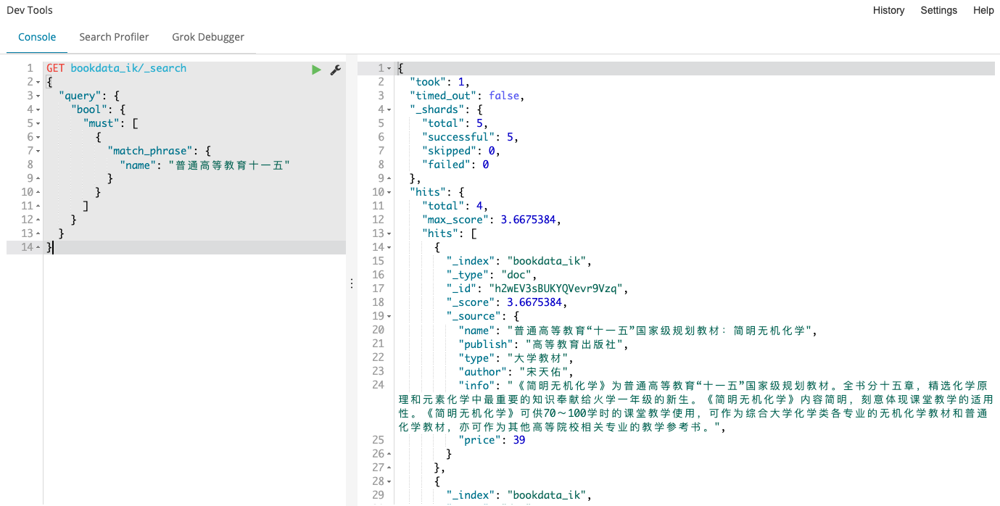
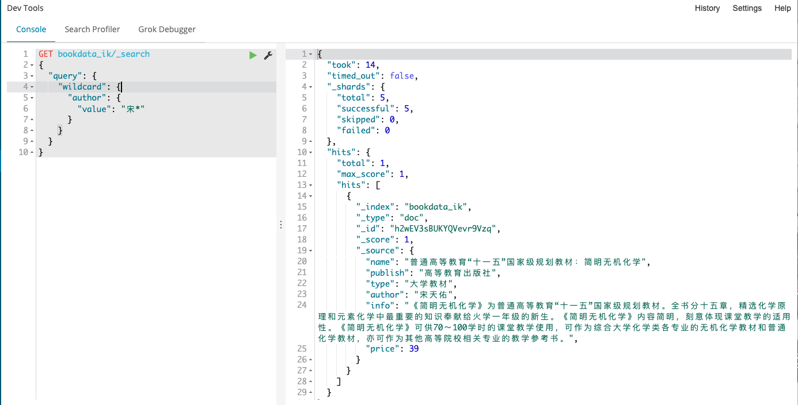

# ELK


## 介绍

ELK是三个开源软件的缩写，分别表示：Elasticsearch , Logstash, Kibana , 它们都是开源软件。新增了一个FileBeat，它是一个轻量级的日志收集处理工具(Agent)，Filebeat占用资源少，适合于在各个服务器上搜集日志后传输给Logstash，官方也推荐此工具。

Elasticsearch是个开源分布式搜索引擎，提供搜集、分析、存储数据三大功能。它的特点有：分布式，零配置，自动发现，索引自动分片，索引副本机制，restful风格接口，多数据源，自动搜索负载等。主要负责将日志索引并存储起来，方便业务方检索查询。

Logstash 主要是用来日志的搜集、分析、过滤日志的工具，支持大量的数据获取方式。一般工作方式为c/s架构，client端安装在需要收集日志的主机上，server端负责将收到的各节点日志进行过滤、修改等操作在一并发往elasticsearch上去。是一个日志收集、过滤、转发的中间件，主要负责将各条业务线的各类日志统一收集、过滤后，转发给 Elasticsearch 进行下一步处理。

Kibana 也是一个开源和免费的工具，Kibana可以为 Logstash 和 ElasticSearch 提供的日志分析友好的 Web 界面，可以帮助汇总、分析和搜索重要数据日志。

## 安装

### Elasticsearch安装

拉取镜像，启动容器

```
docker pull docker.elastic.co/elasticsearch/elasticsearch:6.3.2
docker run -d --name es -p 9200:9200 -p 9300:9300 -e "discovery.type=single-node" docker.elastic.co/elasticsearch/elasticsearch:6.3.2
```

修改配置文件,配置跨域

```
└─# docker exec -it es /bin/bash
[root@e7afd579e061 elasticsearch]# ls
LICENSE.txt  NOTICE.txt  README.textile  bin  config  data  lib  logs  modules  plugins
[root@e7afd579e061 elasticsearch]# cd config/
[root@e7afd579e061 config]# ls
elasticsearch.keystore  ingest-geoip  log4j2.properties  roles.yml  users_roles
elasticsearch.yml       jvm.options   role_mapping.yml   users
[root@e7afd579e061 config]# vi elasticsearch.yml 
```

```
# 修改elasticsearch.yml文件，加入跨域配置
http.cors.enabled: true
http.cors.allow-origin: "*"
```

访问Elasticsearch默认9200端口

```
http://10.182.61.116:9200/
```



### Kibana安装

拉取镜像，启动容器

```
docker pull docker.elastic.co/kibana/kibana:6.3.2
docker run --name es_kibana -p 5601:5601 -d -e ELASTICSEARCH_URL=http://172.17.0.15:9200 docker.elastic.co/kibana/kibana:6.3.2
```

**注意Elasticsearch和Kibana版本问题，版本相差较大时，可能会导致Kibana连接不上Elasticsearch**

访问Kibana的5601端口


## 官方文档

Filebeat：

https://www.elastic.co/cn/products/beats/filebeat
https://www.elastic.co/guide/en/beats/filebeat/5.6/index.html

Logstash：
https://www.elastic.co/cn/products/logstash
https://www.elastic.co/guide/en/logstash/5.6/index.html

Kibana:

https://www.elastic.co/cn/products/kibana

https://www.elastic.co/guide/en/kibana/5.5/index.html

Elasticsearch：
https://www.elastic.co/cn/products/elasticsearch
https://www.elastic.co/guide/en/elasticsearch/reference/5.6/index.html

elasticsearch中文社区：
https://elasticsearch.cn/

## Elasticsearch

### Elasticsearch 架构原理

#### ES 简介

**概念**

>   Elasticsearch is a highly scalable open-source full-text search and analytics engine. It allows you to store, search, and analyze big volumes of data quickly and in near real time. It is generally used as the underlying engine/technology that powers applications that have complex search features and requirements.

解释一下，ES 是一个拥有**高扩展性**的**全文搜索和分析引擎**。允许用户近实时地存储、查询、分析大量的数据。ES 通常应用于**复杂查询**的场景。有以下几个主要点：

-   高扩展性
-   全文检索和分析
-   存储大量数据
-   近实时的查询性能

**应用场景**

由于官网内容比较长：

-   电子商务网站，为用户提供查询和搜索提示功能，比如京东的商品搜索功能；
-   收集日志数据进行分析，判断趋势指标等；
-   降价提醒功能，当某个商品价格低于某个值时，提醒用户购买，也就是京东的降价提醒功能。

#### ES 架构 

架构主要自下而上包括以下几个部分：

-   Gateway 是最底层索引文件存储，支持多种类型的文件系统，包括本地文件系统、共享文件系统、HDFS 和 Amanzon S3。
-   第二层是核心 Lucene 分词引擎，主要功能是进行分词和索引建立。
-   第三层是 ES 自己的模块，包括集群节点发现，脚本支持模块和第三方插件模块。
-   第四层是传输层，支持多种传输方式，包括 Thrift、HTTP、JMX 等。
-   第五层是对外接口层，支持 RESTful API 交互方式和 Java API 两种方式。

#### ES核心概念

##### 字段 Field

字段在ES中可以理解为JSON数据的键，下面的JSON数据中，*name* 就是一个字段。

```
{
    "name":"jack"
}
```

##### 文档 Document

*文档* 在ES中相当于传统数据库中的*行*的概念，ES中的数据都以JSON的形式来表示，在MySQL中插入一行数据和ES中插入一个JSON文档是一个意思。下面的JSON数据表示，一个包含3个字段的*文档*。

```
{
    "name":"jack",
    "age":18,
    "gender":1
}

```

##### 映射Mapping

映射 是对文档中每个字段的类型进行定义，每一种数据类型都有对应的使用场景。例如：string的数据会被作为全文本来处理，这种数据类型适合需要搜索的场景。有些数据类型，你不需要对它进行搜索，相反需要对它做聚合运算，那么keyword、integer 数据类型就更合适。
正如上面说的，每个文档都有映射，但是在大多数使用场景中，我们并不需要显示的创建映射，因为ES中实现了动态映射。我们在索引中写入一个下面的JSON文档，在动态映射的作用下，name会映射成text类型，age会映射成long类型。

```
{
    "name":"jack",
    "age":18,
}
```

既然有动态映射，我们当然也可以自定义映射，在深度使用中，我们需要对数据类型进行精确的控制，以达到我们实际场景的要求，ES可能不知道我们需要数据类型，这种情况下我们可以使用自定义映射。通过映射API，我们可以方便的`创建`、`修改`、`查看`、`删除`映射。

##### 索引 Index

*索引*是ES中最大的数据单元，相当于关系型数据库中 `库`的概念。前面我们说一个*文档* 相当于MySQL中一行数据，如果按照关系型数据库中的对应关系，还应该有`表`的概念。ES中没有`表`的概念，这是ES和数据库的一个区别，在我们建立*索引*之后，可以直接往 *索引* 中写入*文档*。在6.0版本之前，ES中有`Type`的概念，可以理解成关系型数据库中的`表`，但是官方说这是一个设计上的失误，所以在6.0版本之后`Type`就被废弃了。

##### 分片 Shards

上面我们说*索引*是ES中最大的数据存储单元，我们可以往*索引*中不断写入*文档*，到了一定数量级，索引文件就会占满整个服务器的磁盘，磁盘容量只是其中一个问题，索引文件变的大，会严重降低搜索的效率。怎么解决这个问题呢？分片就是用来解决这些问题的，简单来讲，分片就是把单索引文件分成多份存储，且这些索引的分片可以分部在不同的机器上。假设单台机器磁盘容量1TB，现在需要存放5TB的索引数据，那就可以把5TB索引分成10份，分别存放到10台机器上每份500G，这就是所谓的`分片`。

##### 副本 Replicas

我们已经知道，一个索引可以分成多个分片，分部在不同的机器上。那假设上面所说的10台机器中有一台发生故障了，在这台机器上的分片也就没了，就会导致索引损坏。为了解决索引高可用的问题，ES引入了*副本*机制，这里的副本指的就是分片的副本，分片的原始数据称为`主分片`，主分片和副本会放在不同的机器上，这样假设有一个分配丢失了，另外的分片可以作为后备。如果主分片的机器挂掉了，其中一个副本分片就会升级成主分片。同时，因为副本分片的工作和主分片是一样的，所以增加副本的数量可以提升查询性能。

##### 词项 term

在传统关系型数据库中，假如想要存储一篇几千字的文本，可以通过`text`直接存进去，和存储其它类型的数据没什么不同。存储虽然很方便，但是要对文本中的关键词进行搜索，查询速度非常慢，尤其是在大数据量的时候。还是上面的场景，在ES中存储这篇文章，它不会直接存进去，而是先把大文本切割成很多个小的词，这些词就是我们所说的`词项 `，它是ES搜索的最小单位，每个查询都是按`词项`搜索的。ES使用了`倒排索引`来存储数据，什么是倒排索引？在关系型数据中，最好的方式是用主键id来查询，可以快速定位到文章内容，而`倒排索引`则相反，它建立的是`词项`和文章id的对应关系，索引它更适合文本搜索，下面是一个倒排索引，hello和world这两个词都命中了id=1的文章。


倒排索引底层原理决定了ES天生适合做全文本搜索。

##### 配置 Setting

Settings是对集群中索引的定义信息，比如一个索引默认的分片数、副本数等。

##### 分析器 Analyzers

前面说过，ES中不会把一篇文章直接存入磁盘，在存储时它会先对文本进行分析，分析器的就是用来分析这些文本，中间包括过滤、分词等过程，经过分析处理后再存储到磁盘。分析器由3部分组成，分别是`字符过滤器`、`分词器`和`词项处理器`。字符过滤器把原始文本作为字符流来处理，它可以过滤一些特殊字符、html标签等；`分词器`是分析器的核心部分，它负责把大文本分割成多个`词项`，比如文本 `"Quick brown fox!"`，可以被分割成 3个词项，`[Quick, brown, fox!] `；`词项处理器`接受词项流，它可以移除一些不需要的词。ES提供了多种分析器，默认使用标准的分析器，能满足大部分的需求，实在不行也可以使用自定义的`分析器`，除了分析器以外，分词器、字符过滤器等在ES中也提供了多种选择。

##### 节点 Node & 集群 Cluster

简单来讲，*节点*就是一个ElasticSearch进程，当我们启动一个ElasticSearch程序，就启动了一个*节点*，很多个*节点*集合在一起就成了*集群*，即使只有单个节点，也可以把它看成只有单个节点的*集群*。节点也分多种类型，主要分为 *主节点*、*数据节点*、*协调节点*和*Ingest节点*，每个节点都有各自的职责，如果集群中只有单个节点，那这个节点会扮演多个节点的角色，它需要独自完成整个搜索和索引的过程。集群对外提供服务时，相当于一个整体，集群中的每个节点都可以处理Http请求，每个请求经过一系列内部转发，处理完成后返回数据给外部客户端。集群内部每个节点之间通信使用Java API ，它的底层是基于TCP的自定义协议，而对于外部客户端，ES使用的是Restful风格的Http协议。

在Elasticsearch集群中，节点的状态有Green、Yellow、Red三种。

*   Green，绿色，表示节点运行状态为健康状态。所有主分片和副本分片都可以正常工作，集群100%健康。
*   Yellow，黄色，表示节点的运行状态为预警状态。所有的主分片都可以正常工作，但是至少有一个副本分片是不能正常工作的。此时集群仍然可以正常工作，但集群的高可用性在某种程度上被弱化。
*   Red，红色，表示集群无法正常工作。此时，集群中至少有一个分片的主分片及他的全部副本都不可正常工作。虽然集群的查询操作还可以进行，但是也只能返回部分数据（其他正常分片的数据可以被正常返回），而分配到这个有问题分片的写入请求会报错，最终造成数据丢失。

查看创建的集群健康状态

```
GET _cluster/health?pretty
或者使用
curl "http://10.182.61.116:9200/_cluster/health?pretty"
```


**这里解释一下为什么集群状态为yellow**
由于我们是单节点部署elasticsearch作的一个Demo，而默认的分片副本数目配置为1，而相同的分片不能在一个节点上，所以就存在副本分片指定不明确的问题，所以显示为yellow，

*   可以通过在elasticsearch集群上添加一个节点来解决问题
*   可以删除那些指定不明确的副本分片下面我们试一下删除副本分片的办法

```
PUT _settings
{
  "number_of_replicas" : 0
}
```


可以看到经过刚才的处理以后集群的状态变成了Green

```
└─# curl "http://10.182.61.116:9200/_cluster/health?pretty"                             
{
  "cluster_name" : "docker-cluster",
  "status" : "green",
  "timed_out" : false,
  "number_of_nodes" : 1,
  "number_of_data_nodes" : 1,
  "active_primary_shards" : 10,
  "active_shards" : 10,
  "relocating_shards" : 0,
  "initializing_shards" : 0,
  "unassigned_shards" : 0,
  "delayed_unassigned_shards" : 0,
  "number_of_pending_tasks" : 0,
  "number_of_in_flight_fetch" : 0,
  "task_max_waiting_in_queue_millis" : 0,
  "active_shards_percent_as_number" : 100.0
}
```

#### ES倒排索引

##### 正排索引

正排索引也称为"前向索引"，这种组织方法在建立索引的时候结构比较简单，建立比较方便且易于维护;因为索引是基于文档建立的，若是有新的文档加入，直接为该文档建立一个新的索引块，挂接在原来索引文件的后面。若是有文档删除，则直接找到该文档号文档对应的索引信息，将其直接删除。
他适合根据文档ID来查询对应的内容。但是在查询一个keyword在哪些文档里包含的时候需对所有的文档进行扫描以确保没有遗漏，这样就使得检索时间大大延长，检索效率低下。


*   优点：工作原理非常的简单。
*   缺点：检索效率太低，只能在一起简单的场景下使用。

##### 倒排索引

根据切分的关键词表去找含有这个关键词的文档ID


倒排索引基本概念

**单词编号(Word ID)**：与文档编号类似，搜索引擎内部以唯一的编号来表征某个单词，单词编号可以作为某个单词的唯一表征。

**单词词典(Lexicon)**：搜索引擎的通常索引单位是单词，单词词典是由文档集合中出现过的所有单词构成的字符串集合，单词词典内每条索引项记载单词本身的一些信息以及指向“倒排列表”的指针。

*   实现-哈希表实现单词词典的存储和快速检索

    

    

 **倒排列表(PostingList)**：倒排列表记载了出现过某个单词的所有文档的文档列表及单词在该文档中出现的位置信息，每条记录称为一个倒排项(Posting)。根据倒排列表，即可获知哪些文档包含某个单词。

**倒排文件(Inverted File)**：所有单词的倒排列表往往顺序地存储在磁盘的某个文件里，这个文件即被称之为倒排文件，倒排文件是存储倒排索引的物理文件。

*   **单词ID**：记录每个单词的单词编号；
*   **单词**：对应的单词；
*   **文档频率**：代表文档集合中有多少个文档包含某个单词
*   **倒排列表**：包含单词ID及其他必要信息
*   **DocId**：单词出现的文档id
*   **TF**：单词在某个文档中出现的次数
*   **POS**：单词在文档中出现的位置


他们三者关系可以由一下图片表示：


#### ES中文分词

前面介绍了Elasticsearch使用倒排索引快速搜索数据，实现倒排索引的前提就是分词，把text格式的字段按照分词器进行分词并编排索引

**内置分词器梳理**


但是ES的默认分词器对于中文的支持不是很好，只是机械的把单个汉字分词，需要引入其他的分词方式。

```
GET _analyze
{
	"text":"中国农业银行"
}
```


这里介绍ES的一个插件：[IK中文分词器](https://github.com/medcl/elasticsearch-analysis-ik/)

安装IK插件

```
docker cp /home/kali/Desktop/elasticsearch-analysis-ik-6.3.2.zip es:/usr/share/elasticsearch/plugins/ik 复制指定版本的IK分词器到容器内目录下
解压压缩包
重启es容器
```

**IK分词器有两种分词模式**

-   k_max_word：会将文本做最细粒度的拆分，例如「中华人民共和国国歌」会被拆分为「中华人民共和国、中华人民、中华、华人、人民共和国、人民、人、民、共和国、共和、和、国国、国歌」，会穷尽各种可能的组合
-   ik_smart：会将文本做最粗粒度的拆分，例如「中华人民共和国国歌」会被拆分为「中华人民共和国、国歌」


```
PUT accounts
{
  "mappings": {
    "person": {
      "properties": {
        "username": {
          "type": "text",
          "analyzer": "ik_max_word",
          "search_analyzer": "ik_smart"
        },
        "title": {
          "type": "text",
          "analyzer": "ik_max_word",
          "search_analyzer": "ik_smart"
        },
        "desc": {
          "type": "text",
          "analyzer": "ik_max_word",
          "search_analyzer": "ik_smart"
        }
      }
    }
  }
}
```

```
POST accounts/person
{
  "user": "张三的歌",
  "title": "Python网络爬虫工程师",
  "desc": "系统管理"
}

POST accounts/person
{
  "user": "李四",
  "title": "java后端开发工程师",
  "desc": "账户管理系统"
}

# 根据条件查询
GET accounts/person/_search
{
  "query" : {
    "match" : {
      "title" : "后端开发工程师" 
      
    }
  }
}
```
#### ES基础操作

##### 新建index

```
PUT /sample-test2
{
  "mappings": {
    "doc":{
      "properties":{
        "dga_family":{
          "type":"keyword"
        },
        "domain":{
          "type": "keyword"
        },
        "domain_level":{
          "type": "integer"
        },
        "tld":{
          "type":"text"
        },
        "db_date":{
           "type": "date"
        },
        "end_valid_time":{
           "type": "date"
        },
        "start_valid_time":{
           "type": "date"
        }
      }
    }
  }
}
```


##### 写入数据

###### 使用Restful API批量写入

```
curl -XPOST "http://10.182.61.116:9200/_bulk?pretty" -H "Content-Type: application/json;charset=UTF-8" --data-binary @dga_data_demo.json
```


###### 第三方库

使用自己熟悉语言的Elasticsearch库批量写入数据到ES

##### 删除Index

```
DELETE /sample-test2
```


##### 全文查询

**测试数据**

*   新建index，设置分词器

```
PUT /bookdata_ik
{
  "mappings": {
    "doc":{
      "properties":{
        "name":{
          "type":"text",
          "analyzer": "ik_max_word",
          "search_analyzer": "ik_max_word"
        },
        "publish":{
          "type": "text",
          "analyzer": "ik_max_word",
          "search_analyzer": "ik_max_word"
        },
        "type":{
          "type": "text",
          "analyzer": "ik_max_word",
          "search_analyzer": "ik_max_word"
        },
        "author":{
          "type":"keyword"
        },
        "info":{
           "type": "text",
          "analyzer": "ik_max_word",
          "search_analyzer": "ik_max_word"
        },
        "price":{
           "type": "integer"
        }
      }
    }
  }
}
```

*   测试数据如下

```
{"index":{"_index":"bookdata_ik","_type":"doc"}}
{"name":"普通高等教育“十一五”国家级规划教材：简明无机化学","publish":"高等教育出版社","type":"大学教材","author":"宋天佑","info":"《简明无机化学》为普通高等教育“十一五”国家级规划教材。全书分十五章，精选化学原理和元素化学中最重要的知识奉献给火学一年级的新生。《简明无机化学》内容简明，刻意体现课堂教学的适用性。《简明无机化学》可供70～100学时的课堂教学使用，可作为综合大学化学类各专业的无机化学教材和普通化学教材，亦可作为其他高等院校相关专业的教学参考书。","price":39}
{"index":{"_index":"bookdata_ik","_type":"doc"}}
{"name":"测试商品","publish":"农村读物出版社","type":"小学通用","author":"","info":"","price":5}
{"index":{"_index":"bookdata_ik","_type":"doc"}}
{"name":"普通高等教育十一五国家级规划教材・经济数学：线性代数","publish":"高等教育出版社","type":"大学教材","author":"王卫华，曾祥金","info":"《经济数学：线性代数》是普通高等教育“十一五”国家级规划教材，是在第一版（普通高等教育“十五”国家级规划教材）的基础上修订而成的，是经济数学首门国家级精品课程的使用教材。《经济数学：线性代数》的主要内容有：线性方程组的消元法和矩阵的初等变换，行列式、克拉默法则，矩阵的运算，线性方程组的理论，特征值和特征向量、矩阵的对角化，二次型，应用问题。全书习题分节配置，除第七章外，每章后配有总习题。《经济数学：线性代数》以线性方程组和实二次型化成标准形为两条主线展开讨论，注重将数学建模思想渗透到教学内容中，突出“矩阵方法”，强调矩阵初等变换的应用，由浅人深，由具体到抽象，循序渐进，化难为易，便于教学。《经济数学：线性代数》结构严谨，逻辑清晰，叙述清楚，说明到位，行文流畅，例题丰富，可读性强，可作为经济管理类专业的教材或教学参考书，也可供工科专业参考使用。","price":18}
{"index":{"_index":"bookdata_ik","_type":"doc"}}
{"name":"普通高等教育“十一五”国家级规划教材配套参考书：电子技术基础（数字部分）重点难点题解指导考研指南","publish":"高等教育出版社","type":"大学教材","author":"秦臻","info":"《电子技术基础》是“数字电子技术基础”课程的辅导教材，可与康华光主编、邹寿彬和秦臻副主编的教材《电子技术基础数字部分》(第五版","price":0}
{"index":{"_index":"bookdata_ik","_type":"doc"}}
{"name":"普通高等教育“十一五”国家级规划教材：土木工程概论（第3版）","publish":"高等教育出版社","type":"大学教材","author":"","info":"本书第3版为普通高等教育“十一五”国家级规划教材，是新世纪土木工程系列教材之一，也是“高等教育百门精品课程教材建设计划”的研究成果，是在第2版的基础上修订而成的。本书着重介绍土木工程专业的基本内容，以简明、新颖、实用为特点，展现土木工程的历史、现状、成就和最新发展。本书第3版改为四色印刷，以全新的、以学生为本的教材版式和插图来呈现土木工程领域的有关内容，更加注重反映土木工程发展的最新成果，注重将历史人文内容、哲理贯穿于教材内容之中。本书将纸质教材与网络资源相结合，在教材的相关部分，都设计了相应知识点的网上链接地址，以方便将文字教材和网络资源结合起来展开教与学。全书共分十五章，分别就课程的任务和学习建议、土木工程材料、基础工程、建筑工程、交通土建工程、桥梁工程、港口工程、地下工程、水利水电工程、给排水工程、土木工程施工、建设项目管理、土木工程防灾与减灾、数字化技术在土木工程中的应用、土木工程师设计方法等方面进行了介绍，尽可能从学科概论的视角反映土木工程的综合性、社会性及其在技术、经济与管理方面的统一性，并在进行工程教育的过程中告诉学生从事土木工程专业的思想和方法。本书可以作为土木工程、水利工程、建筑学和城市规划等专业的教材和教学参考书，也可作为其他理工类和人文类专业的选修课教材，同时亦可供高职高专与成人高校师生使用。本书附有充值卡，用户可登录“中国高校土木工程课程网”","price":30}
```

es 全文查询主要用于在全文字段上，主要考虑查询词与文档的相关性（Relevance）。

###### match

```
GET bookdata_ik/_search
{
  "query": {
    "match": {
      "publish": "农村读物出版社"
    }
  }
}
```


###### match query

match query **用于搜索单个字段**，首先会针对查询语句进行解析（经过 analyzer），主要是对查询语句进行分词，分词后查询语句的任何一个词项被匹配，文档就会被搜到，默认情况下相当于对分词后词项进行 or 匹配操作。

```
GET bookdata_ik/_search
{
  "query": {
    "match": {
      "publish": {
        "query": "农村读物 出版社"
      }
    }
  }
}
```


如果想查询匹配所有关键词的文档，可以用 and 操作符连接，如下：

```
GET bookdata_ik/_search
{
  "query": {
    "match": {
      "publish": {
        "query": "农村读物 出版社",
        "operator": "and"
      }
    }
  }
}
```


###### multi_match query

multi_match 是 match 的升级，**用于搜索多个字段**。查询语句为“教材 课程”，查询域为 “name” 和 “info”，查询语句如下：

```
GET bookdata_ik/_search
{
  "query": {
    "multi_match": {
      "query": "教材 课程",
      "fields": ["name", "info"]
    }
  }
}
```


###### 匹配短语检索（Match_Phrase Query）

match_phrase查询分析文本，并从分析文本中创建短语查询。

```
GET bookdata_ik/_search
{
  "query": {
    "bool": {
      "must": [
        {
          "match_phrase": {
            "name": "普通高等教育十一五"
          }
        }
      ]
    }
  }
}
```



但是需要匹配的短语分词以后最后一个词语如果不在原来文档的分词结果中时，是匹配不到的，下面的查询语句是匹配不到文档的

```
GET bookdata_ik/_search
{
  "query": {
    "bool": {
      "must": [
        {
          "match_phrase": {
            "name": "普通高等教育十一五国"
          }
        }
      ]
    }
  }
}
```


但是补全最后一个词语以后就可以匹配到了

```
GET bookdata_ik/_search
{
  "query": {
    "bool": {
      "must": [
        {
          "match_phrase": {
            "name": "普通高等教育十一五国家级"
          }
        }
      ]
    }
  }
}
```


###### 匹配解析前缀检索（Match_Phrase_Prefix）

用户已经渐渐习惯在输完查询内容之前，就能为他们展现搜索结果，这就是所谓的即时搜索（instant search） 或输入即搜索（search-as-you-type） 。

不仅用户能在更短的时间内得到搜索结果，我们也能引导用户搜索索引中真实存在的结果。

例如，如果用户输入 johnnie walker bl ，我们希望在它们完成输入搜索条件前就能得到： Johnnie Walker Black Label 和 Johnnie Walker Blue Label 。

match_phrase_prefix与match_phrase相同，除了它允许文本中最后一个术语的前缀匹配。

```
GET bookdata_ik/_search
{
  "query": {
    "bool": {
      "must": [
        {
          "match_phrase_prefix": {
            "name": "普通高等教育十一五国"
          }
        }
      ]
    }
  }
}
```


##### 多值精确查询（terms query）

terms是包含的意思，如下语句可以匹配“info”字段中有"高等教育"或者"网络资源"文档

```
GET /bookdata_ik/_search
{
  "query": {
    "terms": {
      "info": [
        "高等教育",
        "网络资源"
      ]
    }
  }
}
```


##### 范围检索（range query）

range查询可同时提供包含（inclusive）和不包含（exclusive）这两种范围表达式，可供组合的选项如下：

```
gt: > 大于（greater than）
lt: < 小于（less than）
gte: >= 大于或等于（greater than or equal to）
lte: <= 小于或等于（less than or equal to）
```

类似sql中的范围查询：

```
SELECT document FROM test_index WHERE age BETWEEN 10 AND 30
```

可以使用如下查询

```
GET bookdata_ik/_search
{
  "query": {
    "bool": {
      "must": [
        {
          "range": {
            "price": {
              "gte": 15,
              "lte": 40
            }
          }
        }
      ]
    }
  }
}
```


##### 存在与否检索（exist query）

使用exist配合must或者must_not可以实现某个字段是否存在的检索

```
SELECT * FROM test_index WHERE age IS NULL
SELECT * FROM test_index WHERE age IS NOT NULL
```

```
GET bookdata_ik/_search
{
  "query": {
    "bool": {
      "must": {
        "exists": {
          "field": "info"
        }
      }
    }
  }
}
```


##### 前缀检索（Prefix Query）

匹配包含 not analyzed（未分词分析）的前缀字符：

```
GET bookdata_ik/_search
{
  "query": {
    "prefix": {
      "author": {
        "value": "宋"
      }
    }
  }
}
```


##### 通配符检索( Wildcard Query)

匹配具有匹配通配符表达式（ (not analyzed ）的字段的文档。 支持的通配符：

1）***** 它匹配任何字符序列（包括空字符序列）；

2）**?** 它匹配任何单个字符。

```
GET bookdata_ik/_search
{
  "query": {
    "wildcard": {
      "author": {
        "value": "宋*"
      }
    }
  }
}
```



##### 正则表达式检索（Regexp Query）

正则表达式查询允许您使用正则表达式术语查询。
举例如下：

```
GET bookdata_ik/_search
{
  "query": {
  "regexp":{
  "author": "[\u4e00-\u9fa5]+"
  }
  }
}
```


##### 模糊检索（Fuzzy Query）

模糊查询查找在模糊度中指定的最大编辑距离内的所有可能的匹配项，然后检查术语字典，以找出在索引中实际存在待检索的关键词。

```
GET bookdata_ik/_search
{
  "query": {
   "fuzzy": {
     "name": {"value": "重点难点"}
   }
  }
}
```


## Kibana

Kibana是一个开源的分析和可视化平台，设计用于和Elasticsearch一起工作。

你用Kibana来搜索，查看，并和存储在Elasticsearch索引中的数据进行交互。

你可以轻松地执行高级数据分析，并且以各种图标、表格和地图的形式可视化数据。

Kibana使得理解大量数据变得很容易。它简单的、基于浏览器的界面使你能够快速创建和共享动态仪表板，实时显示Elasticsearch查询的变化。

### Discover

____

你可以从Discover页面交互式的探索你的数据。你可以访问与所选择的索引默认匹配的每个索引中的每个文档。你可以提交查询请求，过滤搜索结构，并查看文档数据。你也可以看到匹配查询请求的文档数量，以及字段值统计信息。如果你选择的索引模式配置了time字段，则文档随时间的分布将显示在页面顶部的直方图中。


### Visualize

Visualize使得你可以创建在你的Elasticsearch索引中的数据的可视化效果。然后，你可以构建dashboard来展示相关可视化。


### Dashboard

将创建的Visualize可视化组建编排起来，组成可视化大屏，Kibana仪表板显示可视化和搜索的集合。你可以安排、调整和编辑仪表板内容，然后保存仪表板以便共享它。


### Dev Tools

开发者工具，其中使用较多的就是Console，可以在这里很方便的使用Restful API查询Elasticsearch的相关数据


**本文用到的测试数据均已经上传Github**

```
Github链接: https://github.com/Double-q1015/elk
```

